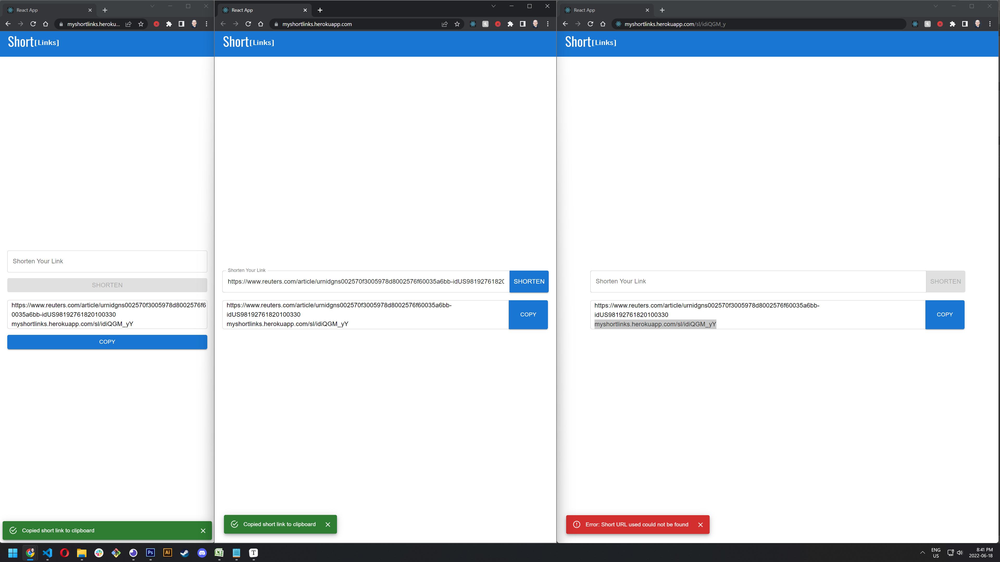

# MERN Stack URL Shortener

Link shortening application that uses mongodb for storage and react as front end with express handling request.

Live View: https://myshortlinks.herokuapp.com/

## Features

Aside from shortening the url.

1. If you put in a incorrect shortlink or the server is down you will be noticed of an error.
2. When you click copy you are notified you have successfully copied the link to your clipboard.
3. Local storage was added to record the last shortlink of the user and upon reloading will render it as long as it still exist.

## Steps to run locally

1. You will need node and the mongo shell installed.
2. There is an example.env file remove the example for it to act as your development variables.
3. Install scripts in both the top level and client folders.
4. Run npm start which will run both the express and react servers.
5. Optionally run tests against api calls by changing into the client directory then running npm run test

## Available Scripts

In the project directory, you can run:

### `npm start`

Open [http://localhost:3000](http://localhost:3000) to view it in the browser.

### `npm test`

Launches the test runner in the interactive watch mode. 

### `npm run build`

Builds the app for production to the `build` folder used for the deployed application
